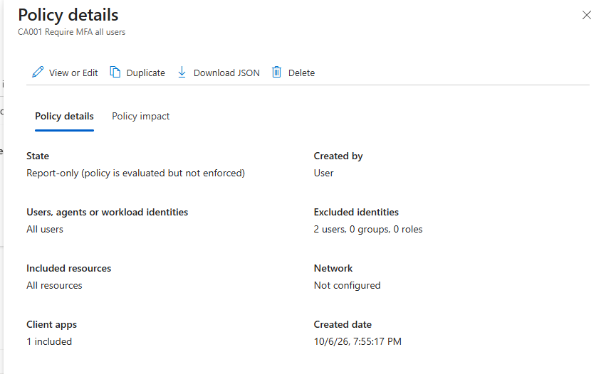
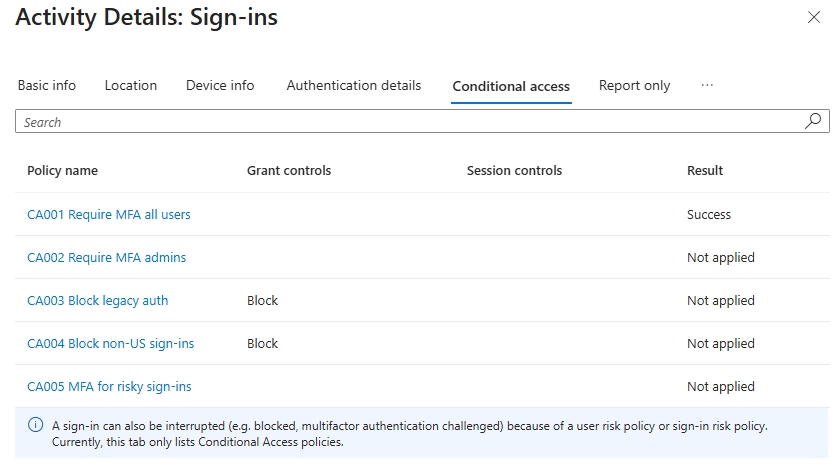
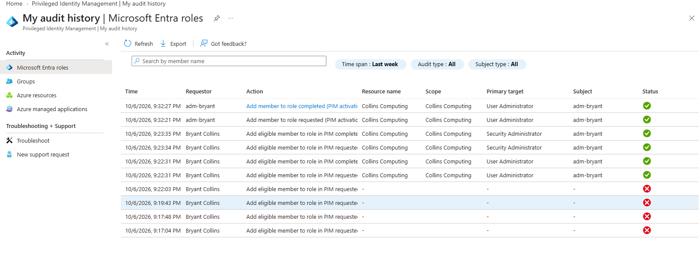
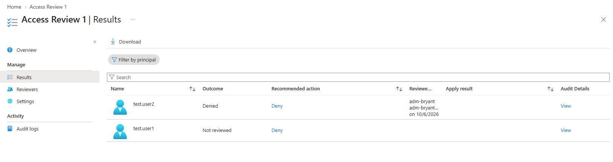

# Lab 1: Entra ID IAM Lab

## Goal
Build a secure identity baseline in a lab Entra tenant: MFA, Conditional Access, just-in-time admin roles, and access governance.

## What I built
- Department groups plus a license group using group-based licensing
- 2 break-glass accounts and a separate daily admin account
- 6 Conditional Access policies (table below)
- PIM eligible roles with MFA, justification, and approval
- An access review of a group, with results applied
- An access package with approval

## Conditional Access policies
| Policy | Purpose | Result I observed |
|---|---|---|
| CA001 | Require MFA for all users | 
| CA002 | Require MFA for admin roles | 
| CA003 | Block legacy authentication | 
| CA004 | Block non-US sign-ins | 
| CA005 | MFA for risky sign-ins | 
| CA006 | Protect security-info registration | 

## Evidence

