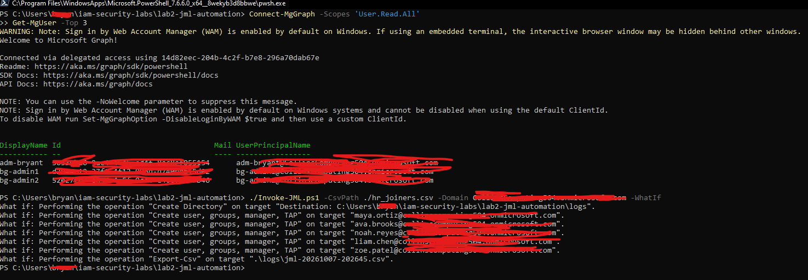
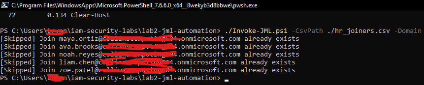
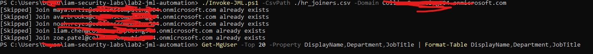
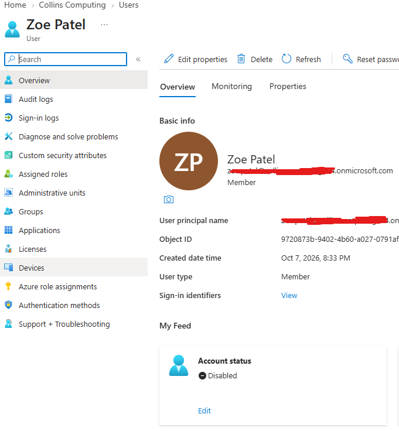

# Lab 2: Joiner-Mover-Leaver Automation

## Goal
Automate account lifecycle work from an HR CSV using PowerShell 7 and Microsoft Graph.

## How it works
The script reads each row of the CSV and runs one of three actions:
- **Join:** creates the account, adds department groups (which assigns the license), sets the manager, and issues a one-time Temporary Access Pass.
- **Move:** swaps department groups and updates department and title.
- **Leave:** disables the account, revokes sessions, removes groups, and flags any admin roles for review.

## Design choices
- Dry run with -WhatIf before any change
- Safe to re-run: existing users are skipped
- A results log that never contains secrets
- Temporary Access Pass instead of shared passwords
- Group-based licensing instead of per-user license calls
- [add your own]

## Run it
See the files in this folder: `Invoke-JML.ps1`, `config-groups.csv`, `hr_joiners.csv`, `hr_changes.csv`, and `sample-log.csv` (sanitized).

## Evidence

## What I would change in production
- [for example: run unattended with a certificate, delete leavers after a retention period, pull from a real HR system]