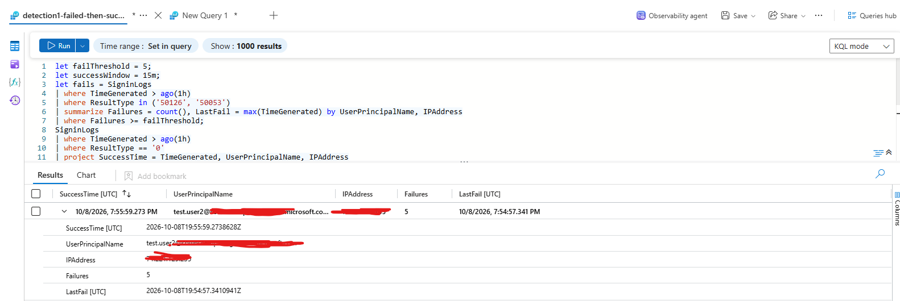
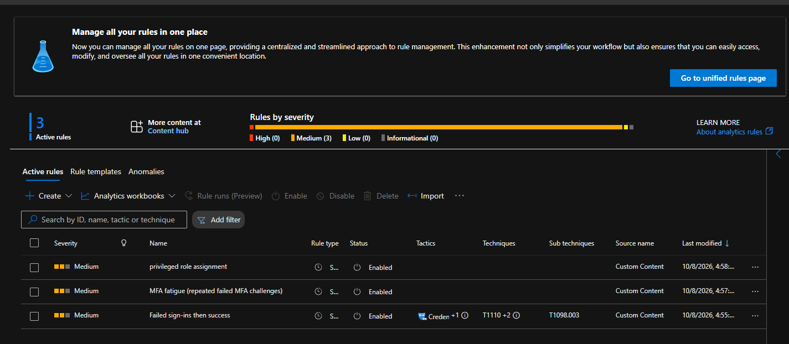
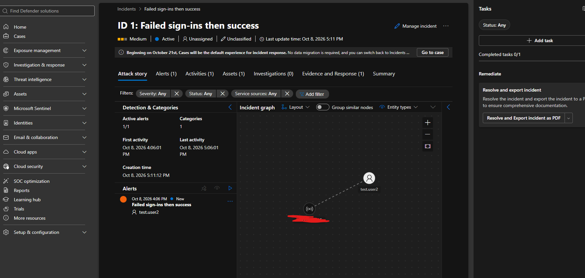

# Lab 4: Microsoft Sentinel Detections

## Goal
Ingest Entra sign-in and audit logs into Microsoft Sentinel and detect suspicious identity activity.

## What I built
- Log Analytics workspace with Microsoft Sentinel and the Entra ID connector
- 3 KQL detections mapped to MITRE ATT&CK (queries in [kql](./kql))

| Detection | What it catches | MITRE |
|---|---|---|
| Failed sign-ins then success | Possible password guessing | T1110 |
| MFA fatigue | Repeated failed MFA prompts | T1621 |
| Privileged role assignment | New admin role grants | T1098.003 |

## How I tested
I triggered each pattern with my own test users in the lab tenant, then confirmed the rule created an incident.

## Evidence

Incident write-ups: [incident-notes.md](./incident-notes.md)

## What I would change in production
- [I would add allow-lists and automate the responses]